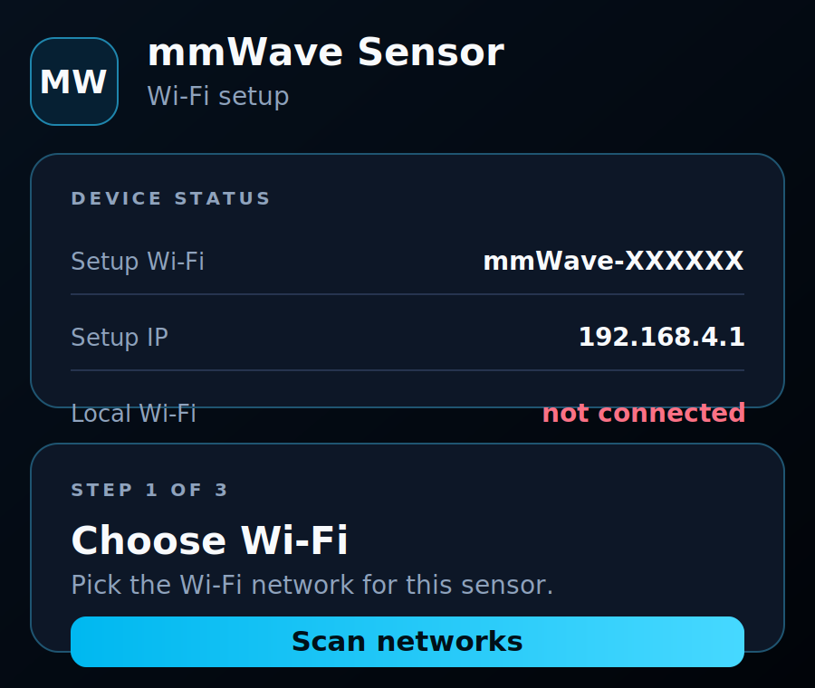
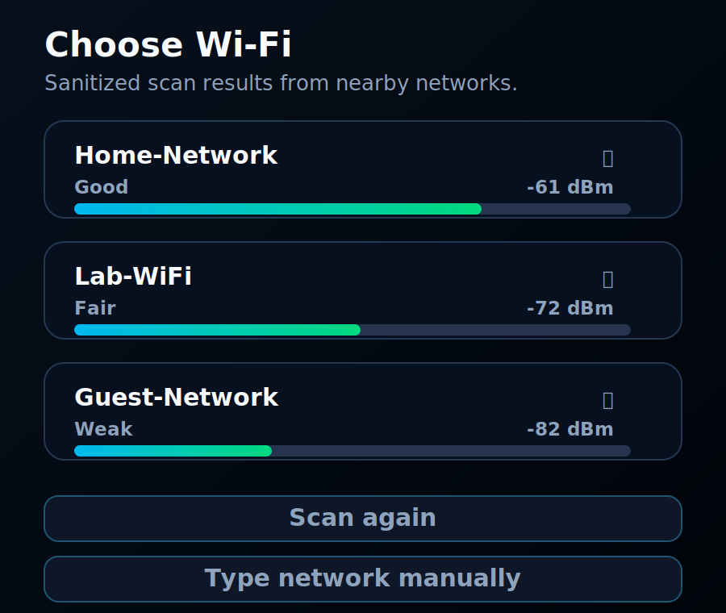
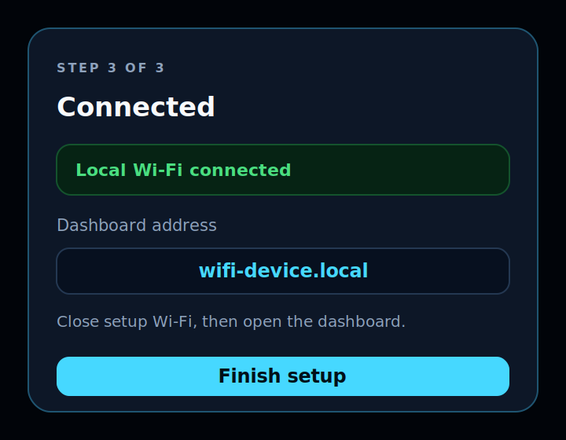
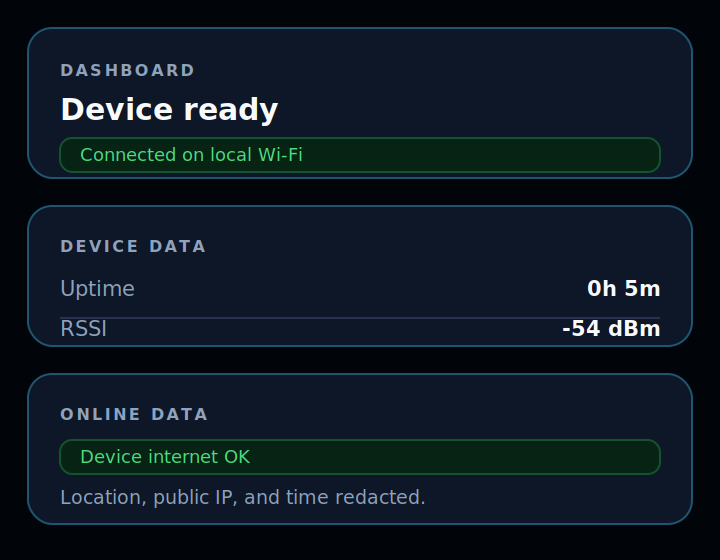

# local-device-portal

Browser-based setup portal for local ESP32 devices. The firmware provides Wi-Fi
provisioning and a local dashboard without requiring a native app, cloud service,
or manual DHCP address lookup.

## User Flow

1. Join the device setup network: `WifiDevice-XXXXXX`.
2. Open the captive setup page or visit `http://192.168.4.1/`.
3. Select a local Wi-Fi network and enter the password.
4. Use the dashboard at `http://wifi-device-xxxxxx.local/`.

The numeric DHCP address remains available as a fallback when mDNS is not
available on the local network.

## Portal Walkthrough

The screenshots below show the intended portal flow. They are sanitized SVG
redraws of the working Arduino portal screens; real network names, local details,
timestamps, dashboard IDs, and location data are intentionally removed.

<table>
  <tr>
    <td width="50%" valign="top">
      <h3>1. Setup portal</h3>
      <p>The device starts its setup access point and serves the local portal at <code>http://192.168.4.1/</code>.</p>
      
    </td>
    <td width="50%" valign="top">
      <h3>2. Network scan</h3>
      <p>The user scans nearby Wi-Fi networks, chooses the target network, and enters the password.</p>
      
    </td>
  </tr>
  <tr>
    <td width="50%" valign="top">
      <h3>3. Connected handoff</h3>
      <p>After the device joins local Wi-Fi, the setup portal shows the local dashboard hostname and a clear handoff step.</p>
      
    </td>
    <td width="50%" valign="top">
      <h3>4. Local dashboard</h3>
      <p>The dashboard confirms local Wi-Fi connectivity and shows runtime and RSSI.</p>
      
    </td>
  </tr>
</table>

## Firmware Targets

The Arduino firmware is the reference workflow. The Zephyr firmware follows the
same setup flow, routes, and dashboard handoff behavior.

```text
arduino/local_device_portal/      Arduino firmware
zephyr/local_device_portal/       Zephyr firmware application
```

Current Zephyr board targets:

```text
esp32_devkitc/esp32/procpu        ESP-WROOM-32 style boards
esp8684_devkitm                   ESP32-C2 class ESP8684-DevKitM boards
xiao_esp32c6/esp32c6/hpcore       Seeed Studio XIAO ESP32-C6
```

Other ESP32 boards can use the same app when Zephyr provides a matching Wi-Fi
board target. Useful reference targets to compare against include
`esp32c3_devkitm`, `esp32c3_devkitc`, `esp32c6_devkitc/esp32c6/hpcore`,
`esp32s2_devkitc`, and `esp32s3_devkitc/esp32s3/procpu`. Confirm the exact
board name in your workspace with `west boards | grep -i esp32`.

ESP32-C2 class support uses Zephyr's `esp8684_devkitm` board target. Zephyr
documents that board as an ESP32-C2 SoC target:
https://docs.zephyrproject.org/latest/boards/espressif/esp8684_devkitm/doc/index.html

Espressif's board guide is here:
https://docs.espressif.com/projects/esp-dev-kits/en/latest/esp8684/esp8684-devkitm-1/user_guide.html

## Repository Layout

```text
.
├── arduino/                      Arduino firmware and notes
├── zephyr/                       Zephyr app manifest and firmware app
│   ├── west.yml                  Zephyr workspace manifest
│   └── local_device_portal/      Zephyr application
├── assets/                       Sanitized README images
├── LICENSE
├── README.md
└── .gitignore
```

## Support Matrix

```text
Arduino
  Tested: ESP32-C6
  Expected-compatible: ESP-WROOM-32, ESP32-C2, ESP32-C3, ESP32-C6, ESP32-S2, ESP32-S3 boards that support Wi-Fi AP+STA, Preferences, and mDNS

Zephyr
  Build-verified: ESP-WROOM-32, XIAO ESP32-C6, ESP32-C2 class ESP8684-DevKitM
  Portable to other ESP32 boards after adding and verifying the matching Zephyr board target
```

## Zephyr Workspace Model

This repository is a Zephyr application repository. Running `west update` from
the repository root creates workspace dependencies beside the product code:

```text
deps/
modules/
tools/
bootloader/
build/
```

Those directories are generated workspace content and are intentionally ignored
by Git. Product code stays in `arduino/` and `zephyr/local_device_portal/`.

## Production Notes

- Change the default AP password in `portal_config.h` before shipping a device.
- Saved Wi-Fi credentials are stored in flash/NVS/settings and are not encrypted
  unless platform security is enabled.
- Arduino defaults to offline dashboard data with UTC as the timezone label.
  The firmware does not call external time, location, or weather services.
- Enable flash encryption and secure boot on production targets if you need
  stronger protection for stored credentials.
- Set `CLEAR_WIFI_ON_NEW_UPLOAD` to `true` only when you want each new Arduino
  upload to reset saved Wi-Fi during development.

## Documentation

```text
zephyr/README.md                  Zephyr setup, build, flash, monitor
arduino/README.md                 Arduino workflow
CONTRIBUTING.md                   Repo contribution expectations
SECURITY.md                       Security handling and reporting notes
```
